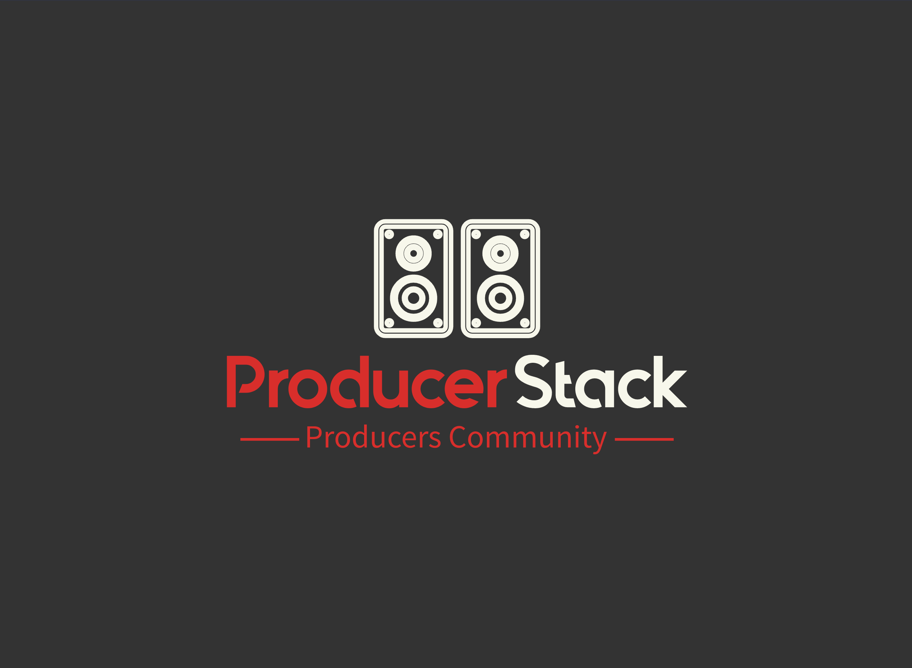

<div align="center">
  

  # ProducerStack

  **Collaborative toolkit for music producers — share beats, analyze audio, and master tracks directly in your browser.**

[](https://rubyonrails.org/)
[](https://www.ruby-lang.org/)
[](LICENSE)
</div>

---

## Overview
ProducerStack is a full-stack Rails application curated for beat makers, engineers, and music enthusiasts. It blends community features (profiles, blogs, beat library) with hands-on audio tooling: waveform playback, analyzer insights, and a SoX-powered mastering workflow featuring multiple presets. Whether you are logging new ideas or preparing a release, ProducerStack keeps production steps in one place.

## Feature Highlights
- **Account management & security** – Devise authentication, customizable profiles, admin dashboards for moderation.
- **Beat uploads & library** – CarrierWave + Active Storage for artwork, WaveSurfer.js playback visuals, metadata-rich listings.
- **Community publishing** – Rich blog creation, sharing, and discovery flows to keep the network active.
- **Audio analyzer** – Aubio + FFprobe pipeline surfaces tempo, key, duration, and sanity stats for any uploaded file.
- **Mastering presets** – SoX-based chains (Standard, Warm, Wide, Punchy, Lo-Fi, Clean) return downloadable masters with peak/RMS metrics.
- **Modern UI** – Bootstrap 5 styling with off-canvas navigation, responsive layouts, and hero branding.

## Table of Contents
1. [Stack & Dependencies](#stack--dependencies)
2. [Quick Start](#quick-start)
3. [Environment Configuration](#environment-configuration)
4. [Mastering Presets](#mastering-presets)
5. [Testing](#testing)
6. [Project Structure](#project-structure)
7. [Contribution Guide](#contribution-guide)
8. [License & Contact](#license--contact)

## Stack & Dependencies
| Area | Technology |
| ---- | ---------- |
| Backend | Ruby on Rails 7.2, PostgreSQL |
| Frontend | Bootstrap 5, Stimulus, Importmap |
| Authentication | Devise |
| File handling | CarrierWave, Active Storage |
| Audio tooling | Aubio CLI, FFmpeg/FFprobe, SoX, WaveSurfer.js |
| Background helpers | Figaro for environment secrets |

Make sure the following executables are installed on any machine running mastering or analysis:
```bash
brew install sox lame      # mastering + mp3 support
brew install aubio ffmpeg  # analyzer + duration detection
```

## Quick Start
```bash
# 1. Clone the repository
git clone https://github.com/your-username/producer-stack.git
cd producer-stack

# 2. Install Ruby gems and JS packages
bundle install
npm install

# 3. Configure database (PostgreSQL by default)
bin/rails db:setup

# 4. Launch the application
bin/rails server

# Visit the app at http://localhost:3000
```

## Environment Configuration
Set sensitive or environment-specific values via Figaro (`config/application.yml`) or your preferred secrets manager. Typical keys:

| Key | Description |
| --- | ----------- |
| `DOLBY_API_KEY` / `DOLBY_API_SECRET` | Optional legacy integration (currently superseded by SoX presets). |
| `MAILER_HOST` | Hostname for Devise mailers in production. |
| `AWS_*` | Required only if switching uploads from local storage to S3. |

Ensure `.ruby-version` matches the interpreter you are using (`3.3.4`).

## Mastering Presets
ProducerStack ships with curated SoX chains tailored for common mastering goals:

| Preset | Use Case | Chain (high level) |
| ------ | -------- | ------------------ |
| Standard | Balanced output, general purpose | Multiband compand, gentle EQ, light reverb, limiter |
| Warm | Vintage, smooth | Softer compression, boosted lows, rolled highs |
| Wide | Airy, spacious | Stereo chorus, bright EQ, mild compression |
| Punchy | Loud, modern | Aggressive compand, mid/high lift, tight limiting |
| Lo-Fi | Texture, nostalgia | Band-limiting, saturation, tremolo, contrast |
| Clean | Minimal coloration | Transparent compression, subtle EQ, dithering |

Mastered assets are saved under `public/mastered`. For production deployments, consider automatic pruning or mirroring to S3/Cloudinary.

## Testing
Rails’ built-in test framework covers controllers, models, and service objects. Run the suite with:
```bash
bundle exec rails test
```

Key coverage includes:
- Audio analyzer edge cases (missing dependencies, parsing failures)
- Mastering controller scenarios (success, validation errors)
- SoX service behavior (dependency detection, preset chains)

## Project Structure
```
app/
  controllers/
    analyze_controller.rb     # Tempo/key/duration pipeline
    mastering_controller.rb   # Upload + preset orchestration
  models/                     # Beat, Blog, User domain models
  services/mastering/         # SoX processing service + presets
  views/mastering/            # Mastering UI form/results
  javascript/                 # WaveSurfer config, Stimulus controllers
config/routes.rb              # REST resources + analyzer/mastering endpoints
public/mastered/              # Generated masters (gitignored)
```

## Contribution Guide
1. Create a feature branch from `main`.
2. Keep changes focused; include tests and documentation updates where relevant.
3. Run `bundle exec rails test` before opening a PR.
4. Describe the change, testing notes, and any environment considerations in the PR template.

Community contributions and feedback are always welcome—file issues or start a discussion in the repository.

## License & Contact
Released under the MIT License. See [`LICENSE`](LICENSE) for details.

Questions, feature ideas, or collaboration requests? Email [trentongarner.13@gmail.com](mailto:trentongarner.13@gmail.com).
